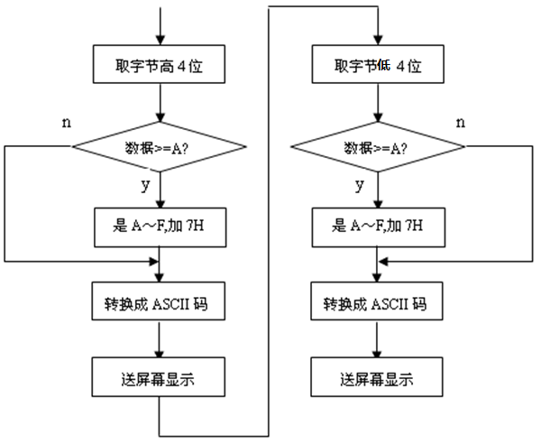
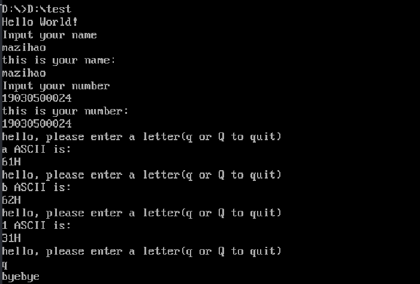

# 实验一 汇编语言编程实验

# 一、实验目的

1. 掌握汇编语言的编程方法

2. 掌握DOS功能调用的使用方法

3. 掌握汇编语言程序的调试运行过程


# 二、实验环境

* 软件集成编译系统：**星研集成环境软件**


# 三、实验内容

1. 将指定数据区的字符串数据以ASCII码形式显示在屏幕上，并通过DOS功能调用完成必要提示信息的显示。

2. 输入自己的学号和姓名，并在屏幕上显示。

3. 循环从键盘读入字符并回显在屏幕上，然后显示出对应字符的ASCII码，直到输入”Q”或“q”时结束。

4. 自主设计输入显示信息，完成编程与调试，演示实验结果。


# 四、实验步骤

1. 运行QTHPCI软件，根据实验内容，参考程序流程图编写程序。

2. 选择“项目”菜单中的“编译”或“编译连接”对实验程序进行编译连接。

3. 选择“调试”菜单中的“进行调试”，进入Debug调试，观察调试过程中传输指令执行后各寄存器及数据区的内容。按F9连续运行。


## 4.1 输出指定字符串

$的含义：预定义符，汇编中字符串结束的标志

用09H功能输出字符串


## 4.2 输入姓名，然后输出姓名

定义缓冲区：

```assembly
buffer1 DB  20  ;预定义20字节空间
        DB  ?   ;输入完成后，自动获取字节数
        DB  20  DUP(0)
```

​	在内存中申请一个缓冲区，为20个字节，首地址给buffer1。

* 缓冲区的第一个字节内放的是20，表示申请的存放数据的缓冲区的字节数为20个；
* 第二个字节“？”表示的是实际存放的字节个数；
* DB表示的是分配一个或多个字节；
* 输入的数据从第三个字节开始存放，存放至第21个字节，第20个字节存放回车符（0DH）,0DH作为输入数据的结束。
* DUP(0)表示的是存放数据的19个字节初始值全为0，即为：20 0 0 0 0······（第21个字节） 0DH。


用0AH功能接收字符串

用09H功能输出字符串


对字符串的处理：在字符串末尾放置符号$


## 4.3 输入字符，转ASCII

用01H功能获得字符



字符转换成ASCII的数字字符：

* 当某一位十六进制的数的值在0~9范围内的时候，将这个数的“值”转成它显示的“字”，即转成ASCII码，只需要加30H即可
* 当某一位十六进制的数的值在A-F范围内的时候，将这个数的“值”转成它显示的“字”，即转成ASCII码，需要加37H即可


用02H功能输出转换后的数字字符

## 4.4 代码及注释


```assembly
;lab1
MYSTACK SEGMENT STACK
        DW 20 DUP(0)
MYSTACK ENDS

DATA SEGMENT

CRLF       DB  0DH,0AH,'$'                 ;终止并换行 
msgHel     DB  'Hello World!','$'          ;待输出字符串,$结束符
tipINam    DB  'Input your name','$'       ;提示输入姓名
tipINum    DB  'Input your number','$'     ;提示输入学号
tipONam    DB  'this is your name:','$'    ;提示输出姓名
tipONum    DB  'this is your number:','$'  ;提示输出姓名
tipQuit    DB	0DH,0AH,'byebye','$'		  ;quit

msg2    DB  'hello, please enter a letter(q or Q to quit)','$'
msg3    DB  ' ASCII is:','$'
char    DB  ?

buffer1 DB  20  ;预定义20字节空间
        DB  ?   ;输入完成后，自动获取字节数
        DB  20  DUP(?)

buffer2 DB  20  
        DB  ?   
        DB  20  DUP(?)

DATA ENDS

CODE SEGMENT
    ASSUME CS:CODE, DS:DATA, SS:MYSTACK
START:
    MOV AX, DATA    ;赋值DATA的段地址给DS寄存器
    MOV DS, AX

    LEA DX, msgHel     ;输出指定字符串
    MOV AH, 09H     
    INT 21H

    LEA DX, CRLF    ;换行
    MOV AH, 09H
    INT 21H

    LEA DX, tipINam    ;输出提示
    MOV AH, 09H    
    INT 21H

    LEA DX, CRLF    ;换行
    MOV AH, 09H
    INT 21H

    LEA DX,buffer1  ;接收name字符串
    MOV AH,0AH
    MOV AL,00H
    INT 21H

    ;对字符串进行处理:在末尾加$表示字符串结束
    MOV AL,buffer1[1]
    ADD AL,2
    MOV AH,0
    MOV SI,AX
    MOV buffer1[SI],'$'

    LEA DX,CRLF     ;换行
    MOV AH,09H
    INT 21H

    LEA DX, tipONam    ;输出提示
    MOV AH, 09H     
    INT 21H

    LEA DX, CRLF    ;换行
    MOV AH, 09H
    INT 21H

    LEA DX,buffer1[2]  ;输出name字符串
    MOV AH,09H
    INT 21H

    LEA DX, CRLF    ;换行
    MOV AH, 09H
    INT 21H

    LEA DX, tipINum
    MOV AH, 09H     ;输出提示
    INT 21H

    LEA DX, CRLF    ;换行
    MOV AH, 09H
    INT 21H

    LEA DX,buffer2  ;接收number字符串
    MOV AH,0AH
    MOV AL,00H
    INT 21H

    ;处理number字符串,在末尾加$表示字符串结束
    MOV AL,buffer2[1]
    ADD AL,2
    MOV AH,0
    MOV SI,AX
    MOV buffer2[SI],'$'

    LEA DX,CRLF     ;换行
    MOV AH,09H
    INT 21H

    LEA DX, tipONum
    MOV AH, 09H     ;输出提示
    INT 21H

    LEA DX, CRLF    ;换行
    MOV AH, 09H
    INT 21H

    LEA DX,buffer2[2]  ;输出number字符串
    MOV AH,09H
    INT 21H

    LEA DX, CRLF    ;换行
    MOV AH, 09H
    INT 21H

label1:         ;输入字符直到输入字符q或Q   

    LEA DX,msg2      ;输出提示信息
    MOV AH,09H
    INT 21H

    LEA DX,CRLF     ;换行
    MOV AH,09H
    INT 21H

    MOV AH,01H      ;接收一个字符并回显
    MOV AL,00H
    INT 21H

    MOV BL,AL       ;将字符保存在BL中,因为后面的功能可能会影响到AL中的值    

    CMP BL,'q'
    JZ  label2

    CMP BL,'Q'
    JZ  label2

    ;将字符转换成ASCII

    LEA DX,msg3
    MOV AH,09H
    INT 21H

    LEA DX,CRLF     ;换行
    MOV AH,09H
    INT 21H

    ;获取字符高四位
    MOV AL,BL
    AND AL,0F0H
    MOV CL,4
    SHR AL,CL

    ;和0AH比较 
    CMP AL,0AH

    JL label3

    ;大于AH则要加07H
    ADD AL,07H

label3: ;将高四位转换成数字字符
    ADD AL,30H

    ;输出第一个数字字符
    MOV DL,AL
    MOV AH,02H
    INT 21H

    ;获取输入字符的低四位
    MOV AL,BL
    AND AL,0FH

    CMP AL,0AH

    JL label4

    ADD AL,07H

label4: ;将低四位转换成数字字符

    ADD AL,30H

    ;输出第二个数字字符
    MOV DL,AL
    MOV AH,02H
    INT 21H
    
    MOV DL,'H'
    MOV AH,02H
    INT 21H

    LEA DX,CRLF     ;换行
    MOV AH,09H
    INT 21H

    LOOP label1

label2:     ;输入字符的出口
    LEA DX,tipQuit
    MOV AH,09H
    INT 21H
    

    MOV AH,4CH      ;返回DOS系统
    INT 21H

CODE ENDS
END START
```


# 五、实验结果及分析

## 5.1 **实验结果截图**




## 5.2 **分析**

* 第一行: 调用`09H`功能在屏幕中显示了预先定义的字符串`Hello World!` ；
* 第三行: 调用`0AH`功能从键盘输入到缓冲区的 name 字符串；
* 第五行：调用`09H`功能将缓冲区中的name字符串输出在屏幕中显示；
* 第七行和第九行同 name 字符串；
* 第十一行`a ASCII is:` 为调用`01H`功能从键盘输入一个字符并回显；
* 第十二行`61H`：调用两次`02H`功能，将转换好的两个字符输出在屏幕上显示；
* 最后几行：调用01H功能从键盘读入了字符`q`，退出程序回到DOS操作系统中。

