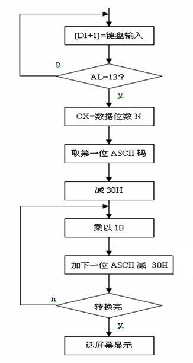
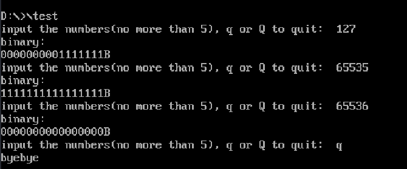

# 实验二 数码转换实验


# 一、实验目的

1. 掌握不同进制数及编码相互转换的程序设计方法。

2. 掌握运算类指令编程及调试方法。

3. 掌握循环程序的设计方法。


# 二、实验环境

* 软件集成编译系统：**星研集成环境软件**


# 三、实验内容

## 3.1 功能一

1. 重复从键盘输入不超过 5 位的十进制数，按回车键结束输入；

2. 将该十进制数转换成二进制数；结果以 2 进制数的形式显示在屏幕上；
3. 如果输入非数字字符，则报告出错信息，重新输入；
4. 直到输入“Q”或‘q’ 时程序运行结束。

## 3.2 功能二

1. 键盘输入一字符串，以空格结束，统计其中数字字符的个数，在屏幕显示


# 四、实验步骤

## 4.1 功能一




1. 输入
2. MO
3. 判断
   1. 是否为q或Q
   2. 是否为回车
   3. 是否大于9或小于0
4. 对每一位 ASCII 码：
   1. 先
   2. 然后用MUL：被乘数为AL的话，乘积存于AX
   3. 带进位的加法指令 ADC

## 4.2 功能一代码及注释

```assembly
MYSTACK SEGMENT STACK
    DB 20 DUP(?)
MYSTACK ENDS

DATA SEGMENT
magInput    DB  'input the numbers(no more than 5), q or Q to quit:  ','$'
msgError    DB  0DH,0AH,'input error!','$'
msgOutput    DB  0DH,0AH,'binary:','$'
msgQuit    DB  0DH,0AH,'byebye','$'
msgcount    DB  'countferring...','$'

CRLF    DB  0DH,0AH,'$'


DATA ENDS

CODE SEGMENT
    ASSUME CS:CODE, DS:DATA, SS:MYSTACK
START:

    MOV AX,DATA
    MOV DS,AX    
    
again:
    LEA DX,magInput     ;输出提示信息1
    MOV AH,09H
    INT 21H

    MOV CL,5		;最多输入5位
    MOV AX,0
    MOV DX,0
    ;MOV SI,0
    MOV DI,0

inputNum:           ;输入不超过五位的十进制数
    MOV AH,01H      ;输入一个字符
    MOV AL,00H
    INT 21H


    CMP AL,' '      ;是否结束输入
    JZ  translate

    CMP AL,'q'      ;是否退出程序   
    JZ  quit

    CMP AL,'Q'      
    JZ  quit

    CMP AL,'0'	     ;输入是否合法
    JL  error

    CMP AL,'9'		;输入是否合法
    JG  error

    JMP count

error:
    CALL pError

count:                  ;按照流程图做乘10加次位操作
    SUB AL,'0'
    MOV BH,0
    MOV BL,AL
    MOV AX,DI
    PUSH BX
    MOV BX,10
    MUL BX		;BX和AX乘积：存储在DX:AX
    POP BX
    ADD AX,BX
    ;ADC DX,0
    ;MOV SI,DX
    MOV DI,AX		;将计算结果存入DI

    LOOP    inputNum

translate:              ;转换二进制形式
    LEA DX,msgOutput    ;输出提示信息
    MOV AH,09H
    INT 21H

    LEA DX,CRLF         ;换行
    MOV AH,09H
    INT 21H

    ;MOV BX,SI           ;调用10进制转换成2进制的函数转为换高16位
    ;CALL I2B
    MOV BX,DI		;转换为低16位二进制
    CALL I2B

    MOV DL,'B'		;二进制数字最后添加B
    MOV AH,02H
    INT 21H

    LEA DX,CRLF         ;换行
    MOV AH,09H
    INT 21H

    JMP again

quit:                  ;退出程序

    LEA DX,msgQuit     ;输出提示信息4
    MOV AH,09H
    INT 21H

    LEA DX,CRLF         ;换行
    MOV AH,09H
    INT 21H

    MOV AH,4CH          ;返回DOS操作系统
    INT 21H

I2B:                    
    MOV CX,16
RS:                     ;对于BX中处理好的数据的每一位,将其转换为字符并从低位开始压栈
    MOV AX,BX           
    AND AX,01H          
    MOV DL,AL
    ADD DL,'0'		;将01转换为字符输出
    PUSH DX             ;因为输出顺序是高位二进制先输出，所以压栈
    SHR BX,1            ;对于ASCII的每一位
    LOOP RS
    
    MOV CX,16
outputBnum:  		;将栈中的数据从高位开始pop
    POP DX
    MOV AH,02H		;输出到屏幕
    INT 21H
    LOOP outputBnum
    RET


pError:
    LEA DX,msgError ;输出提示信息
    MOV AH,09H
    INT 21H

    LEA DX,CRLF     ;换行
    MOV AH,09H
    INT 21H

    RET

CODE ENDS
END START

```


## 4.3 功能二

buff     DB  255, 0, 256 DUP('$') ;

* buffer: 缓冲区的首地址
* 255：缓冲区的第一个字节单元，代表buffer单元的总个数
* 0：缓冲区的第二个字节单元，目前缓冲区中的元素个数
* 256：开辟一个大小为256个字节的缓冲区，每个单元中存放'$'


CMP BYTE PTR [SI]，' '

* PTR强制类型转换为BYTE


标志寄存器：


## 4.4 功能二代码及注释

```assembly
MYSTACK SEGMENT STACK
    DB	10 DUP(0)
MYSTACK ENDS

DATA SEGMENT
    msgInput    DB  0DH,0AH,'Please input the string(no more than 255):',0DH,0AH,'$'
    msgOutput   DB  0DH,0AH,'The number of digits in the string: ',0DH,0AH,'$'
    buff        DB  255, 0, 256 DUP('$') ; 包括一个回车符号 同时保证结尾一定是'$'
DATA ENDS

CODE SEGMENT
    ASSUME CS:CODE, DS:DATA, ES:DATA, SS:MYSTACK

START:
    MOV AX,DATA
    MOV DS,AX
    MOV ES,AX

    LEA DX,msgInput
    MOV AH,09H
    INT 21H

inputString:    ; input string
    LEA DX, buff
    MOV AH,0AH
    MOV AL,00H
    INT 21H

prepare:
    LEA SI,buff
    INC SI		;buffer[1]

    ; CL: store the count of input, used for loop in the future
    MOV CL,[SI]
    INC SI
    
    ;clear BX
    XOR BX, BX      ;store the number of digits

again:
    ; Check if end
    CMP BYTE PTR [SI], ' '
    JE outResult

    ; Check IF NUM
    CMP BYTE PTR [SI], '9'
    JA next
then:
    CMP BYTE PTR [SI], '0'
    JB next

isDigit:
    INC BX

next:   ; next char
    INC SI
    LOOP again

outResult:  ; OUTPUT "RESULT IS: "

    PUSH AX
    LEA DX,msgOutput
    MOV AH, 09H
    INT 21H 
    POP AX

    ; CLEAR RESISTER FOR LATER USE
    XOR CX, CX

L1: 
    SHR BX,1        ;右移1位，将最低位放入标志寄存器的CF位（最低位）
    PUSHF           ;将标志寄存器中的值压栈
    POP DX          ;标志寄存器中的值给到DX
    AND DL,1        ;高位清零，保留最低位CF
    ADD DL,30H      ;从数字转换为字符
    PUSH DX         ;因为从最低位开始读的，所以要利用先读入后输出的机制
    INC CX          ;CX记录要输出的二进制数位的数量
    CMP BX,0        ;看是否数字全部转换了
    JNE L1

    ; 以上实现了到二进制的转换，和到字符的转换，现在我们把它输出
    MOV AH,02H
L2:
    POP DX
    INT 21H
    LOOP L2 ;这里要用到上面的CX

    MOV DL,'B'
    MOV AH,02H
    INT 21H

quit:
    MOV AH,4CH
    INT 21H
CODE ENDS
END START
```


# 五、实验结果及分析

## 5.1 功能一

### 5.1.1 实验结果截图




### 5.1.2 分析

* 第一行`Please input the string(no more than 255):`: 调用`09H`输出字符串
* `127`: 输入的一个十进制数字
* 第三行`0000000001111111B`：转换完成的二进制数
* 可以从第六行看到，最多能表示16位以内的二进制数，即65535
* 最后几行即退出程序，回到DOS操作系统


## 5.2 功能二

### 5.2.1 实验结果截图


### 5.2.2 分析

* 第一行字符串：调用`09H`功能输出提示输入的字符串
* 第二行字符串：调用`0AH`功能，输入的含数字的字符串
* 第四行二进制数：是输入字符串中，空格之前数字的个数
