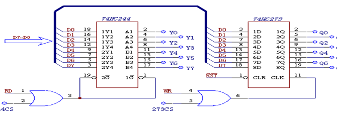
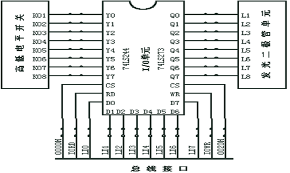

# 实验三 基本 IO 扩展实验


# 一、实验目的

1. 了解TTL芯片扩展简单I/O口的方法。

2. 掌握数据输入输出程序编制的方法。


# 二、实验环境

1. 软件集成编译系统：**星研集成环境软件**
2. 实验箱

# 三、实验内容

本实验要求用 74LS244 作为输入口，读取开关状态，并将此状态通过74LS273 连到发光二极管显示。具体实验内容如下：

1. 开关 Yi 为低电平时对应的发光二极管亮，Yi 为高电平时对应的发光二极管灭。

2. 当开关 Yi 全为高电平时，发光二极管 Qi 从左至右轮流点亮。

3. 当开关 Yi 全为低电平时，发光二极管 Qi 从右至左轮流点亮。

4. 自主设计控制及显示模式，完成编程调试，演示实验结果。


# 四、实验原理

​    **74LS244** 是一种三态输出的8总线缓冲驱动器，无锁存功能，当 G 为低电平，Ai 信号传送到 Yi，当为高电平时，Yi 处于禁止高阻状态;

​    **74LS273** 是一种带清除功能的 8D 触发器， 1D～8D 为数据输入端，1Q～8Q 为数据输出端，正脉冲触发，低电平清除，常用作 8 位地址锁存器。





# 五、实验步骤

  1.	按照实验连线图连接：
      1.	244 的CS接到ISA总线接口模块的 0000H，Y7—Y0——开关K1—K8。
      2.	273 的CS接到ISA总线接口模块的 0020H，Q7—Q0——发光二极管L1—L8。
      3.	该模块的 WR、RD 分别连到ISA总线接口模块的IOWR、IORD。
      4.	该模块的数据（AD0～AD7）连到ISA总线接口模块的数据（LD0～LD7）。
 2.	编写实验程序，编译链接，运行程序
 3.	拨动开关，观察发光二极管的变化。


## 5.1 代码及注释

```assembly
_STACK SEGMENT STACK 
 DW 100 DUP(?) 
_STACK ENDS 

_DATA SEGMENT WORD PUBLIC 'DATA'
IO244 EQU 0230H		 ;244(16位)片选 
IO273 EQU 0230H		 ;273(16位)片选
_DATA ENDS 

CODE SEGMENT 
START PROC NEAR 
	ASSUME CS:CODE, DS:_DATA, SS:_STACK 
	MOV AX,_DATA
	
 	MOV DX,IO244 	;片选244
	IN AX,DX 	;读取开关电平
	CMP AX,0FFFFH	;是否全高电平
	JZ  L
	
	CMP AX,0	;是否全低电平
	JZ  R
	
	
	CMP AX,870FH	;拓展功能
	JZ  X

	
	MOV DX,IO273	;片选273
 	OUT DX,AX	;数据输出到273的输入端口
 	
 	JMP START 	;到开头重新判断开关的电平
 	
 	
R: 	;从左向右轮流亮起
	MOV DX,IO273 	;片选273
 	MOV AX,0FFFEH	;初始化最右边led亮起 
 	
START1: ;开始轮流
	OUT DX,AX 
	
 	CALL Delay 
 	
 	TEST AX,8000H 	;此时是否最左变亮起
 	JZ START 	;若是，则到程序开头判断开关的电平
 	ROL AX,1 	;循环左移一位实现从左向右循环亮起
 	JMP START1 
 	
L: 	;从右向左轮流亮起同上
	MOV DX,IO273 
 	MOV AX,7FFFH 
 	
START2: OUT DX,AX 
 	CALL Delay 
 	CMP AX,0FFFEH 
 	JZ START 
 	ROR AX,1 	;循环右移数据实现轮流亮起
 	JMP START2 
 	
	
X:	;左右同时向中间
	MOV DX,IO273
	MOV AX,07FFEH
	
START3:	OUT DX,AX
        CALL Delay
        
	TEST AX,0180H
	JZ START
	
	;开始下一个变换
	MOV BX,AX
	MOV CX,AX
	ROL BX,1
	ROR CX,1
	
	MOV AL,BL
	MOV AH,CH
	
	JMP START3
	
Delay PROC NEAR ;延时 
Delay1: XOR CX,CX 
 	LOOP $ 
 	RET 
Delay ENDP 

START ENDP 
CODE ENDS 
 	END START
```


# 六、实验结果及分析

## 6.1 实验结果

编译链接项目后，改变开关Yi观察到如下现象：

* 开关Yi为低电平时对应的发光二极管亮，Yi为高电平时对应的发光二极管灭；
* 当开关Yi全为高电平时，发光二极管Qi从左至右轮流点亮；
* 当开关Yi全为低电平时，发光二极管Qi从右至左轮流点亮；
* **拓展功能：**当开关电平组成的数据为0x0F时，发光二极管从两边同时向中间亮起。


## 6.2 分析

在QTH 编译环境下编译实现要求的代码， 实验结果如下

- 在 32 位微机高级实验仪上，开关全部往上拨即开关全为高电平时发光二极管从左至右依次点亮;
- 在 32 位微机高级实验仪上 开关全部往下拨即开关全为低电平时发光二极管从右至左依次点亮;
- 在现有基础上，拓展代码，使得当K0~K3开关中奇数位置的开关为高电平 ，偶数位置的开关为低电平时发光二极管从左至右依次点亮 。
- 在现有基础上，拓展代码，使得当K0~K3开关中 奇数位置的开关为 低 电
  平 ，偶数位置的开关为高电平时发光二极管从右至左依次点亮 。