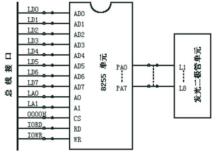

# 实验四 可编程并行接口实验

# 一、实验目的

1.	了解可编程并行接口 8255的内部结构，
2.	掌握工作方式、初始化编程及应用。

# 二、实验环境

* PC机
* QTH编译环境
* 32位微机高级实验仪 

# 三、实验内容

1. 流水灯实验：利用 8255 的 A 口、B 口循环点亮发光二极管。
2. 交通灯实验：利用 8255 的 A 口模拟交通信号灯。
3. I/O 输入输出实验：利用 8255 的 A 口读取开关状态，8255 的 B 口把状态送发光二极管显示。
4. 在完成 (1) 基础上，增加通过读取开关控制流水灯的循环方向和循环方式。
5. 在完成 (2) 基础上，增加通过读取开关控制交通红绿灯的亮灭时间。

## 四、实验原理

​       8255是一个通用可编程并行接口电路。它具有A、B、C三个8位并行口。其中C口也可用作A、B口的联络信号及中断申请信号。通过编程，它可以被设置为基本输入输出、选通输入输出以及双向传送方式。对于C口还具有按位置0、1的功能。

# 五、实验步骤

## 5.1 流水灯实验

* 模块的WR、RD分别连到ISA总线接口模块的IOWR、IORD。

* 模块的数据（AD0～AD7）、地址线（A0～A7）分别连到ISA总线接口模块的数据（LD0～LD7）、地址线（LA0～LA7）。

* 8255模块选通线CE连到ISA总线接口模块的0000H。

* 8255的PA0～PA7连到发光二极管的L0～L7；8255的PB0～PB7连到发光二极管的L8～L15。

* 运行程序，观察发光二极管。

## 5.2 交通灯实验

*  模块的WR、RD分别连到ISA总线接口模块的IOWR、IORD。

* 模块的数据（AD0～AD7）、地址线（A0～A7）分别连到ISA总线接口模块的数据（LD0～LD7）、地址线（LA0～LA7）。

* 8255模块选通线CE连到ISA总线接口模块的0000H。

* 8255的PA0-L7、PA1-L6、PA2-L5、PA3-L3、PA4-L2、PA5-L1。

* 运行程序，观察发光二极管。

# 六、实验结果及分析

本次实验过程主要完成了流水灯实验及其拓展和交通灯模拟实验

1.	在流水灯实验中，实现了流水灯的基本功能，即使其在初始状态下逆时针依次点亮所有灯。
2.	在流水灯实验的拓展中，增加了开关的控制，当开关读取到 00H时，灯点亮的顺序相反，即顺时针依次点亮所有灯。
3.	在交通灯模拟实验中，实现了十字路口交通灯点亮的基本过程，并且在 PC 端加入了字符串状态的显示，方便验证实验。

